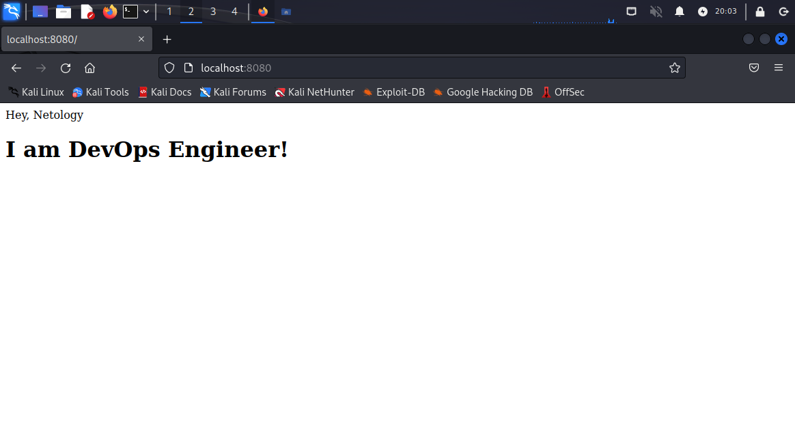

# Домашняя работа к занятию "5.3. Введение. Экосистема. Архитектура. Жизненный цикл Docker контейнера"

---

## Задача 1
Сценарий выполения задачи:
- создайте свой репозиторий на https://hub.docker.com;
- выберете любой образ, который содержит веб-сервер Nginx;
- создайте свой fork образа;
- реализуйте функциональность:
запуск веб-сервера в фоне с индекс-страницей, содержащей HTML-код ниже:
```
<html>
<head>
Hey, Netology
</head>
<body>
<h1>I’m DevOps Engineer!</h1>
</body>
</html>
```
Опубликуйте созданный форк в своем репозитории и предоставьте ответ в виде ссылки на https://hub.docker.com/username_repo.

### Решение:

Скачиваем образ nginx:
```sh 
$ docker pull nginx
Using default tag: latest
latest: Pulling from library/nginx
9e3ea8720c6d: Pull complete 
bf36b6466679: Pull complete 
15a97cf85bb8: Pull complete 
9c2d6be5a61d: Pull complete 
6b7e4a5c7c7a: Pull complete 
8db4caa19df8: Pull complete 
Digest: sha256:480868e8c8c797794257e2abd88d0f9a8809b2fe956cbfbc05dcc0bca1f7cd43
Status: Downloaded newer image for nginx:latest
docker.io/library/nginx:latest
```

Dockerfile:
````bash
FROM nginx
RUN echo '<html><head>Hey, Netology</head><body><h1>I am DevOps Engineer!</h1></body></html>' > /usr/share/nginx/html/index.html
````
Делаем fork образа:
```sh
$ docker build -t quevevee/devops-netology:5.3 .  
```
Пушим образ на dockerhub:
```sh
$ docker push quevevee/devops-netology:5.3
```
Запускаем контейнер с пробросом на 8080 порт хоста:
```sh
$ docker run -d -p 8080:80 quevevee/devops-netology:5.3
```
Смотрим результат в браузере:


Ссылка на репозиторий: https://hub.docker.com/repository/docker/quevevee/devops-netology/general

## Задача 2

Посмотрите на сценарий ниже и ответьте на вопрос:  
"Подходит ли в этом сценарии использование Docker контейнеров или лучше подойдет виртуальная машина, физическая машина? Может быть возможны разные варианты?"  

Детально опишите и обоснуйте свой выбор.

Сценарий:
- Высоконагруженное монолитное java веб-приложение;
- Nodejs веб-приложение;
- Мобильное приложение c версиями для Android и iOS;
- Шина данных на базе Apache Kafka;
- Elasticsearch кластер для реализации логирования продуктивного веб-приложения - три ноды elasticsearch, два logstash и две ноды kibana;
- Мониторинг-стек на базе Prometheus и Grafana;
- MongoDB, как основное хранилище данных для java-приложения;
- Gitlab сервер для реализации CI/CD процессов и приватный (закрытый) Docker Registry.  

### Решение:

- Высоконагруженное монолитное java веб-приложение:
> Физическая машина, чтобы не расходовать ресурсы на виртуализацию и из-за монолитности не будет проблем с разворачиванием на разных машинах.
- Nodejs веб-приложение:
> Docker, для более простого воспроизведения зависимостей в рабочих средах
- Мобильное приложение c версиями для Android и iOS:
> Виртуальные машины, проще для тестирования, размещения на одной хостовой машине
- Шина данных на базе Apache Kafka:
> Docker, есть готовые образы для apache kafka, на руку изолированность приложений, а также легкий откат на стабильные версии в случае обнаружения багов в продакшене
- Elasticsearch кластер для реализации логирования продуктивного веб-приложения - три ноды elasticsearch, два logstash и две ноды kibana:
> Docker, Elasticsearch доступен для установки как образ docker, проще удалять логи, удобнее при кластеризации - меньше времени на запуск контейнеров.
- Мониторинг-стек на базе Prometheus и Grafana:
> Docker. Есть готовые образы, приложения не хранят данные, что удобно при контейниризации, удобно масштабировать и быстро разворачивать.
- MongoDB, как основное хранилище данных для java-приложения:
> Физическая машина как наиболее надежное, отказоустойчивое решение. Либо виртуальный сервер.
- Gitlab сервер для реализации CI/CD процессов и приватный (закрытый) Docker Registry:
> Могут быть применены все варианты, в зависимости от наличия соответствующих ресурсов. Но для большей изолированности лучше использовать docker.

## Задача 3
- Запустите первый контейнер из образа ***centos*** c любым тэгом в фоновом режиме, подключив папку ```/data``` из текущей рабочей директории на хостовой машине в ```/data``` контейнера;
- Запустите второй контейнер из образа ***debian*** в фоновом режиме, подключив папку ```/data``` из текущей рабочей директории на хостовой машине в ```/data``` контейнера;
- Подключитесь к первому контейнеру с помощью ```docker exec``` и создайте текстовый файл любого содержания в ```/data```;
- Добавьте еще один файл в папку ```/data``` на хостовой машине;
- Подключитесь во второй контейнер и отобразите листинг и содержание файлов в ```/data``` контейнера.  

### Решение:

Запускаем первый контейнер из образа ***centos*** с любым тэгом, подключив папку ```/data``` из текущей рабочей директории на хостовой машине в ```/data``` контейнера:

```sh
$ docker run -v /data:/data --name centos-container -d -t centos
```

Запускаем второй контейнер из образа ***debian*** в фоновом режиме, подключив папку ```/data``` из текущей рабочей директории на хостовой машине в ```/data``` контейнера

```sh
$ docker run -v /data:/data --name debian-container -d -t debian
```

Проверяем запущенные контейнеры:

```sh
$ docker ps                                                     
CONTAINER ID   IMAGE     COMMAND       CREATED          STATUS          PORTS     NAMES
10f589eb1950   debian    "bash"        39 seconds ago   Up 34 seconds             debian-container
e95ca9dfd2e0   centos    "/bin/bash"   37 minutes ago   Up 37 minutes             centos-container
```

Подключаемся к первому контейнеру и создаем тестовый текстовый файл в ***/data***:

```sh
$ docker exec centos-container /bin/bash -c "echo test_message > /data/readme.md"
```

Создаем второй тестовый файл на хосте:

```sh
$ cd /data
$ touch testfile
```

Подключаемся во второй контейнер и проверяем листинг и содержание файлов в ***/data*** контейнера.  

```bash
$ docker exec -it debian-container /bin/bash                                   
root@10f589eb1950:/# cd /data
root@10f589eb1950:/data# ls -l
total 4
-rw-r--r-- 1 root root 13 May 15 20:10 readme.md
-rw-r--r-- 1 root root  0 May 15 20:05 testfile
```